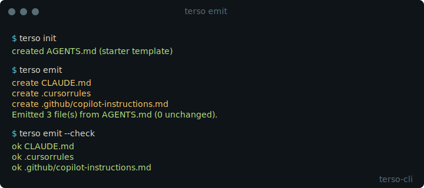

# terso

[](https://github.com/petrkindlmann/terso-cli/actions/workflows/ci.yml)
[](https://www.npmjs.com/package/terso-cli)
[](LICENSE)

**You maintain the same project rules in four files. Stop.**

`terso emit` compiles one `AGENTS.md` into every per-agent config your repo uses
— `CLAUDE.md`, `.cursorrules`, `.github/copilot-instructions.md` — and keeps
them in sync. Offline. No account. No telemetry.



> The asciinema cast at `docs/demo.cast` is the source; `docs/demo.svg` is the
> rendered preview. See [docs/demo.md](docs/demo.md) for how to regenerate.

## Install

```sh
npm install -g terso-cli       # works everywhere
brew install terso-cli         # macOS (coming v1.0)
```

## 30-second quickstart

```sh
cd your-project
terso init        # scaffolds an AGENTS.md if you don't have one
terso emit        # writes CLAUDE.md, .cursorrules, etc.
```

That's it. Edit `AGENTS.md`, re-run `terso emit`, commit the result. Any AI coding
agent in the repo picks up the same rules.

## Commands at a glance

| Command | What it does | Needs Omnus? |
|---|---|---|
| `terso emit` | Compile `AGENTS.md` → per-agent files. | No |
| `terso emit --check` | CI gate. Exit `0` = clean, `1` = drift, `2` = error. | No |
| `terso init` | Scaffold a starter `AGENTS.md`. | No |
| `terso doctor` | Diagnose your install and project. | No |
| `terso install-hook` | Install the Omnus session observer into Claude Code. | No |
| `terso mcp` *(beta)* | Run an MCP server exposing project context. | Yes |
| `terso sync` *(beta)* | Pull project knowledge into `.terso/generated/`. | Yes |
| `terso capture` *(beta)* | Send a knowledge fragment to Omnus. | Yes |
| `terso search` *(beta)* | Search Omnus from the terminal. | Yes |
| `terso auth` *(beta)* | Manage Omnus API auth. | Yes |

Commands marked *(beta)* require an Omnus account and ship production-ready in
v1.1. They work today against the Omnus development instance.

### `terso emit`

| Flag | Behavior |
|---|---|
| `--targets <list>` | Comma-separated subset: `claude`, `cursor`, `copilot`. |
| `--check` | CI gate. Exit `0` = no changes, `1` = changes required, `2` = error. |
| `--dry-run` | Show what would change without writing. |
| `--force` | Overwrite files even if not marked terso-generated. |
| `--watch` | Re-emit on every save of `AGENTS.md`. |

Default behavior emits only to targets whose presence hints exist in the repo
(`.cursor/`, `CLAUDE.md`, `.github/`). On a fresh repo it writes all three.

Each emitted file starts with a generated-by marker. `terso emit` refuses to
overwrite hand-written files without `--force`, so it's safe to drop into a
mature repo.

## CI gate

```yaml
# .github/workflows/agents.yml
name: AGENTS.md
on: [push, pull_request]
jobs:
  emit-check:
    runs-on: ubuntu-latest
    steps:
      - uses: actions/checkout@v4
      - uses: actions/setup-node@v4
        with: { node-version: 22 }
      - run: npx terso-cli emit --check
```

Build fails if anyone hand-edits a per-agent file without updating `AGENTS.md`.
Exit code `1` is the drift signal; `2` is genuine error (missing `AGENTS.md`,
unknown target, blocked write).

## Per-agent quickstarts

- [Claude Code](docs/agents/claude-code.md)
- [Cursor](docs/agents/cursor.md)
- [Codex](docs/agents/codex.md)
- [GitHub Copilot](docs/agents/copilot.md)
- [Aider](docs/agents/aider.md)
- [Continue](docs/agents/continue.md)

## Connect to Omnus *(optional)*

`terso emit` is free forever and works without an account. If your team wants
hosted knowledge memory across projects — search anything you've captured,
auto-sync per-project rules from a central store — [sign up for Omnus](https://omnus.dev?source=terso-cli).

## Contributing

[CONTRIBUTING.md](CONTRIBUTING.md) covers setup, build, and PR expectations.
Security disclosures: [SECURITY.md](SECURITY.md).

## License

MIT
