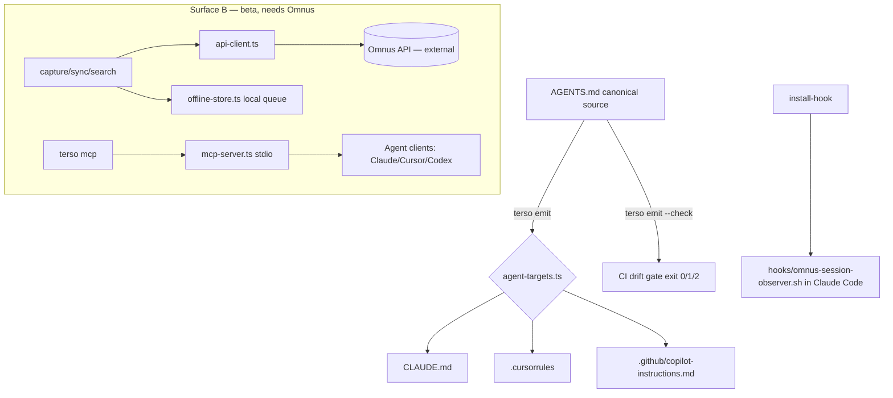

# terso-cli — Project Survey

> Standardized single-repo survey. Evidence base: this repository only
> (`/Users/petr/projects/terso-cli`) plus external market research on the
> AI-coding-agent config-management category. Generated 2026-05-29.
>
> Commercial baseline assumed by this survey: **zero revenue, zero confirmed
> users, no validated pricing, no validated traction.** Any number that is not
> directly evidenced in the repo is labeled inference, market evidence, or a
> calculated estimate.

---

## 1. Executive summary

- **Project name:** terso (npm package `terso-cli`, binary `terso`)
- **One-line description:** A CLI that compiles a single `AGENTS.md` into every
  per-agent config file a repo needs (`CLAUDE.md`, `.cursorrules`,
  `.github/copilot-instructions.md`) and keeps them in sync — offline, no account.
- **What it appears to do:** Eliminates the "same project rules duplicated across
  four agent config files" problem. `terso emit` is a deterministic local
  compiler; `terso emit --check` is a CI drift gate with stable exit codes. A
  second, beta surface (`mcp`, `sync`, `capture`, `search`, `auth`) bridges to a
  separate hosted product called **Omnus**.
- **Current maturity:** **MVP → release-candidate.** Published to npm at `0.3.0`;
  `CHANGELOG.md` shows `1.0.0-rc.1` unreleased. Surface A (offline) is feature-complete
  and tested; Surface B is implemented but gated behind a beta notice and points at an
  Omnus dev instance.
- **Current commercial status:** Zero users and zero revenue assumed. The repo
  contains **no billing, pricing, or paid-tier code of any kind** — by design. Not
  proven otherwise from repo evidence.
- **Main buyer or user:** Individual developers using 2+ AI coding agents in one
  repo (Cursor + Claude Code + Copilot) who maintain duplicate rule files.
  Secondary: teams wanting a CI gate to prevent config drift.
- **Main value proposition:** One source of truth for AI-agent project rules;
  removes manual duplication and drift across per-agent files.
- **Main monetization model (suggested):** **None inside the CLI.** The CLI is a
  free, MIT-licensed open-source wedge whose explicit job is to funnel users to
  Omnus, a separate hosted-knowledge-memory subscription product. Repo states the
  key metric is "CLI install → Omnus free signup conversion."
- **Pricing proven or provisional:** No pricing exists in this repo at all. Any
  monetization lives in the (out-of-repo) Omnus product. **Provisional / N/A.**
- **Overall repo evidence confidence:** **High** (small, clean, well-documented repo).
- **Overall market research confidence:** **Medium** (category is real and fast-moving,
  but the specific "per-agent file compiler" niche has thin public pricing comparables).
- **Short verdict:** **Portfolio asset / validate the funnel first.** As a standalone
  business this repo has no revenue surface — it is a distribution instrument for a
  different product. As a career/portfolio signal and a top-of-funnel growth asset it
  is strong. Worth finishing (it is nearly finished); not worth treating as an
  independent revenue line.

---

## 2. Evidence inventory

| Evidence area | Found? | Files inspected | What it proves | What it does NOT prove |
|---|---|---|---|---|
| Product UI | Partial (CLI only) | `src/index.ts`, `src/commands/*`, `bin/terso.js` | A real Commander-based CLI with 12 commands | No GUI/web UI; no usage |
| Backend/API | Partial (client only) | `src/lib/api-client.ts`, `src/lib/mcp-server.ts` | An Omnus HTTP client + MCP server exist | No server in this repo; Omnus backend not here |
| Auth | Partial | `src/commands/auth.ts`, `src/lib/config.ts` | API-key/config-based auth for Surface B | No identity system, no OAuth proven working |
| Database | Local only | `src/lib/offline-store.ts` | Local offline capture queue (file-based) | No hosted DB; Omnus Postgres is out-of-repo |
| Payments | **No** | full `src/` grep | Deliberately none — "no paid features in CLI" | N/A — monetization is out-of-repo |
| Tests | **Yes** | `tests/**` (11 files, 154 `it/test` cases) | Substantial unit coverage of commands + lib | Exact % not in repo (coverage gate is ≥75% target) |
| CI/CD | **Yes** | `.github/workflows/ci.yml`, `codeql.yml`, `release.yml` | 3-OS × 2-Node matrix, audit gate, offline-import gate, CodeQL, automated npm publish w/ provenance | Live CI run status not in repo snapshot |
| Deployment | **Yes** | `release.yml`, `RELEASE.md`, `package.json` (`prepublishOnly`) | npm publish automation on `v*.*.*` tags | Actual published downloads/installs |
| Monitoring | **No** | full repo | None (consistent with "no telemetry") | N/A |
| Documentation | **Strong** | `README.md`, `docs/agents/*` (6 guides), `docs/troubleshooting.md`, `docs/demo.md`, `CONTRIBUTING.md`, `RELEASE.md`, `SECURITY.md`, `CHANGELOG.md` | Outsider-ready docs, per-agent quickstarts | — |
| Landing page / marketing | Partial | `content/blog/*` (10 posts), `content/announcements/v1.0-launch.md`, `content/calendar.md` | Launch content prepared | Live site is a *separate* repo (terso-site); not here |
| CLI / SDK | **Yes** | `bin/terso.js`, `src/index.ts` | Published CLI is the core artifact | — |
| Integrations | **Yes** | `src/lib/agent-targets.ts`, `hooks/*`, `viral/agents-md-action/*` | 3 emit targets (Claude/Cursor/Copilot), Claude Code session hook, a GitHub Action | Targets for Codex/Aider/Continue documented but not in `AGENT_TARGETS` |
| Security | Partial | `codeql.yml`, `npm audit` gate, `SECURITY.md`, `.github/dependabot.yml` | Reasonable OSS security hygiene | No pen-test / formal review |
| Compliance | **No** | full repo | None | N/A for an offline CLI; relevant only to Omnus |
| Analytics | **No** | full repo | None (by policy). Only a planned `?source=terso-cli` signup URL param | No install/usage analytics exist |
| User/account mgmt | Out-of-repo | `src/commands/auth.ts` only | Account logic belongs to Omnus | No accounts managed in this repo |

---

## 3. Product description from repo evidence

**What it is.** `terso-cli` is a Node.js (ESM, TypeScript-strict) command-line tool
published to npm. Its core command, `terso emit`, reads a canonical `AGENTS.md` and
writes per-agent configuration files, each prefixed with a generated-by marker.
`terso emit --check` is a CI primitive with documented stable exit codes
(`0`=clean, `1`=drift, `2`=error). (`README.md`, `src/commands/emit.ts`.)

**Problem it solves.** Teams using multiple AI coding agents must keep the same
rules in several files (`CLAUDE.md`, `.cursorrules`,
`.github/copilot-instructions.md`, …). They drift. terso makes `AGENTS.md` the single
source and regenerates the rest. (`README.md` headline: "You maintain the same project
rules in four files. Stop.")

**Who it's for.** From `.planning/PROJECT.md`: **Primary** — developers using AI
coding agents maintaining the same rules in 3+ files. **Secondary** — teams wanting a
CI gate. **Aspirational** — terso becomes the dominant tool around the `AGENTS.md`
format.

**Main workflow.** `terso init` (scaffold `AGENTS.md`) → edit `AGENTS.md` →
`terso emit` (write per-agent files) → commit → optionally add `terso emit --check`
to CI. (`README.md` quickstart.)

**Main features (implemented).** `emit` (+ `--check`, `--dry-run`, `--force`,
`--watch`, `--targets`), `init`, `doctor`, `status`, `compile` (emit alias),
`watch`, `install-hook` (wires an Omnus session observer into Claude Code).

**Planned / beta (implemented but gated).** `mcp`, `sync`, `capture`, `search`,
`auth` — all carry a `[beta v1.1]` label and a one-line stderr beta notice, require an
Omnus account, and run against the Omnus dev instance. The code is real (retry +
offline-queue logic in `capture`/`sync`), not a stub.

**Unclear.** README and PROJECT.md reference additional emit targets
(`.codex/instructions.md`, Aider, Continue) and there are 6 per-agent doc guides, but
`src/lib/agent-targets.ts` only defines three targets (`claude`, `cursor`, `copilot`).
So docs imply broader target coverage than the compiler currently emits.

---

## 4. Feature completeness

| Feature | Status | Evidence | Notes |
|---|---|---|---|
| `terso emit` core compile | Implemented | `src/commands/emit.ts`, `agent-targets.ts`, `tests/commands/emit.test.ts` (31 cases) | Plan/create/update/blocked/unchanged states; safe-overwrite logic |
| `emit --check` exit codes | Implemented | `emit.ts` returns 0/1/2; README documents as API | Treated as a stable contract |
| `emit --watch` / `watch` | Implemented | `src/commands/watch.ts` | — |
| `terso init` | Implemented | `src/commands/init.ts`, 21 test cases | — |
| `terso doctor` | Implemented | `src/commands/doctor.ts`, 12 test cases | — |
| `terso status` | Implemented | `src/commands/status.ts` | Thinner test coverage |
| `terso compile` | Implemented | `src/commands/compile.ts` | Alias/wrapper over emit |
| `terso install-hook` | Implemented | `src/commands/install-hook.ts`, hook scripts in `hooks/` | 5 test cases |
| `--version` from package.json | Implemented | `src/lib/version.ts` | Invariant: no hard-coded version |
| Emit targets (claude/cursor/copilot) | Implemented | `agent-targets.ts` | Codex/Aider/Continue documented but not wired |
| `terso mcp` | Implemented (beta-gated) | `src/commands/mcp.ts`, `src/lib/mcp-server.ts`, 14 tests | Needs Omnus auth |
| `terso sync` | Implemented (beta-gated) | `src/commands/sync.ts` | Real client + offline flush |
| `terso capture` | Implemented (beta-gated) | `src/commands/capture.ts` | Retry then offline-queue |
| `terso search` | Implemented (beta-gated) | `src/commands/search.ts` | Omnus-dependent |
| `terso auth` | Implemented (beta-gated) | `src/commands/auth.ts` | API-key/config based |
| Billing / pricing / quota | Missing (by design) | none | Monetization deferred to Omnus |
| Telemetry / analytics | Missing (by policy) | none | Only a planned signup URL param |
| Hosted backend | Missing (out-of-repo) | `api-client.ts` targets Omnus | Omnus lives in a separate project |

---

## 5. Technical architecture

- **Frontend stack:** None (CLI). Commander v12 for parsing; `ora` for spinners.
- **Backend stack:** None in this repo. `src/lib/api-client.ts` is an HTTP client
  for the external Omnus API; `src/lib/mcp-server.ts` builds an MCP stdio server.
- **Database:** None hosted. `src/lib/offline-store.ts` is a local file-based queue
  for offline captures.
- **Auth:** Surface B only — API key / config (`src/commands/auth.ts`, `config.ts`).
- **Payments:** None.
- **Queue/background jobs:** Local offline capture queue with retry + flush-on-sync;
  no server-side jobs.
- **Hosting/deployment:** Published artifact is the npm package (`dist/` + `bin/`).
  Release via tag-triggered GitHub Action (`npm publish --provenance`). Homebrew and
  Scoop manifests drafted (`distribution/`).
- **External APIs:** Omnus REST API (Surface B); MCP SDK for agent clients.
- **Observability:** None (deliberate).
- **Testing:** Vitest, 11 files / 154 cases, 3-OS × 2-Node CI matrix; coverage gate
  target ≥75%.
- **Data model:** Minimal — `AgentTarget` (id/label/outputPath/presenceHints);
  offline capture records (text/projectHint/scopeHint/capturedAt).
- **Security-sensitive components:** Omnus API key handling in `config.ts`; the
  CI "offline-emit import gate" hard-blocks network imports in the emit path.



---

## 6. Codebase maturity

| Area | Score | Evidence | Risk |
|---|---|---|---|
| Structure | 9 | Clean `src/commands` + `src/lib` + mirrored `tests/`; tiny dependency surface (3 runtime deps) | Low |
| Type safety | 9 | TS strict, `typecheck` gated in CI | Low |
| Error handling | 7 | Explicit exit codes, blocked-write handling, retry/offline fallback in capture | Edge paths in beta commands less proven |
| Test coverage | 8 | 154 cases across 11 files; CI coverage job; ≥75% gate target | Exact % not committed to repo |
| Security hygiene | 8 | CodeQL, `npm audit` gate, Dependabot, SECURITY.md, offline-import gate | No formal review; API-key storage simple |
| Config management | 8 | `config.ts`, env-var beta suppression, version-from-package invariant | — |
| Maintainability | 9 | Small, idiomatic, dogfoods its own AGENTS.md | Low |
| Deployment readiness | 8 | Tag-triggered publish w/ provenance + checksums; RELEASE.md | Manual trigger; Homebrew/Scoop not yet live |
| Observability | 2 | None by design | Can't see real-world failures |
| Documentation quality | 9 | README, 6 agent guides, troubleshooting, demo, changelog, contributing | — |

These scores describe **implementation maturity**, not focus-worthiness.

---

## 7. Business model from repo evidence

- **Is there pricing?** No. Nothing in the repo.
- **Provisional or production?** N/A — there is no pricing surface to assess.
- **Stripe / billing?** None. `package.json` has no payment dependency.
- **Tiers?** None in repo.
- **Quota logic?** None.
- **Trial/free-plan logic?** The CLI is wholly free; "free tier" concepts belong to
  Omnus (out-of-repo).
- **Account/team/workspace logic?** Only an Omnus API-key auth stub for Surface B.
- **Onboarding?** CLI onboarding is strong (`init`, `doctor`, per-agent guides). No
  commercial onboarding/activation funnel in-repo.
- **Usage tracking?** None. Only a *planned* `?source=terso-cli` query param on the
  Omnus signup CTA for attribution (`.planning` + announcement notes).
- **Clear buyer?** The *user* is clear (multi-agent developer). The *paying buyer* is
  not in this repo — it's whoever subscribes to Omnus.
- **Landing page specific enough to sell?** The README sells the CLI clearly. There is
  no in-repo sales page for a paid product because the CLI isn't the paid product.

**Conclusion:** This repo is explicitly a **free OSS top-of-funnel wedge**, not a
revenue product. Per `.planning/PROJECT.md`: *"terso emit makes a user love the tool.
Surface B converts love into a paid subscription."* The monetization is real but lives
in Omnus. Assume zero validated willingness-to-pay for *this artifact* specifically.

---

## 8. External market research

> Repo evidence vs. external market evidence vs. analyst assumption are labeled
> inline. Pricing below is **market evidence / analyst estimate**, never from this repo
> (the repo has no pricing).

- **Market category (repo + market):** Developer tooling for AI coding agents —
  specifically *agent configuration/context management* around the emerging `AGENTS.md`
  convention.
- **Demand level (market evidence):** The umbrella category (AI coding assistants) is
  large and rapidly growing through 2025–2026. The *specific* "compile one rules file
  into many agent configs" niche is small but real and growing, riding on `AGENTS.md`
  adoption.
- **Market maturity (analyst):** Early. The `AGENTS.md` format is consolidating; native
  support across agents reduces the per-agent-file problem over time — a structural
  headwind for the tool's core value (see risks).
- **Trend:** Rapidly growing overall category; the *specific* drift-management niche is
  growing but at risk of being absorbed by native standardization.
- **Crowded?** The exact niche is lightly populated (mostly dotfile templates, ad-hoc
  scripts, and editor-native config). The adjacent "AI dev tooling" space is extremely
  crowded.
- **Do buyers understand the category?** Partially. Developers feel the pain ("four
  files") but rarely budget for a dedicated tool to fix it — they reach for a script.
- **Do buyers have budget?** For a free CLI, no budget needed. For the paid layer
  (hosted team knowledge memory), budget exists in teams already paying for Cursor/
  Copilot/Claude seats.
- **What customers use today instead:** Hand-maintained per-agent files; copy-paste;
  small homemade scripts/symlinks; or relying on native `AGENTS.md` support.
- **Solo-founder wedge (analyst):** Realistic wedge = own the `AGENTS.md`-tooling
  mindshare via a clean free CLI + CI gate, and convert a fraction to the paid hosted
  product. The CLI itself is not a standalone monetizable wedge.

### Competitor table

| Competitor | Product type | Target buyer | Pricing model | Strength | Weakness | Relevance to this repo |
|---|---|---|---|---|---|---|
| Native `AGENTS.md` support (Codex/Copilot/Cursor/etc.) | Built-in agent feature | All agent users | Free (bundled) | Zero install; canonical | Doesn't reconcile *legacy* per-agent files | **Highest** — both tailwind (format adoption) and threat (absorbs the need) |
| Hand-rolled scripts / symlinks / dotfiles | DIY | Individual devs | Free | Total control, no dep | Brittle, no CI gate, per-team reinvention | High — the real "do nothing" alternative |
| Rulesync / similar OSS "sync agent rules" tools | OSS CLI | Multi-agent devs | Free OSS | Same wedge | Same commoditization risk; thin moat | High — direct conceptual competitor |
| Continue / Cursor (rules features) | Agent IDE/plugin | Devs/teams | Freemium + seats | Owns the editor surface | Single-agent scope | Medium — overlaps on "rules," not cross-agent sync |
| Omnus (this project's own paid layer) | Hosted knowledge memory | Teams | Subscription (out-of-repo) | The actual revenue product | Not yet public; unproven | Direct — terso is its funnel |

> Competitor pricing for the niche OSS tools is effectively **$0 (free OSS)**. There is
> no established paid price point for "per-agent config compiler" as a standalone — this
> is itself strong evidence the CLI is a funnel, not a product.

---

## 9. Market and buyer hypothesis

*(Inference, labeled. Grounded where possible in repo's stated audience.)*

- **Likely buyer (paid):** *Inference* — an engineering lead/team already paying for
  AI-agent seats who wants shared, synced project knowledge (i.e., the Omnus buyer).
  The CLI itself has no buyer; it has users.
- **Likely user (free):** Repo-stated — a developer running 2–3 agents in one repo.
- **Buyer pain:** Real but low-acuity for the CLI ("annoying duplication"); higher for
  the paid layer ("team knowledge is scattered").
- **Trigger event:** Adding a second or third AI agent to a repo and noticing the rule
  files diverge; or a teammate hand-edits a generated file and CI should have caught it.
- **Why they might pay:** They won't pay for the CLI. They might subscribe to Omnus for
  cross-project hosted memory + in-agent search.
- **Why they might not pay:** The free CLI fully solves the stated pain; native
  `AGENTS.md` support erodes even that; the paid value (hosted memory) is unproven.
- **Sales motion:** Self-serve (free CLI) → product-led funnel to Omnus. Founder-led
  for any early team deals.
- **Trust burden:** Low for the CLI (offline, no account, MIT, no telemetry — these are
  deliberately trust-maximizing). Higher for Omnus (you send it your knowledge).
- **Onboarding burden:** Very low (two commands).
- **Support burden:** Low for a deterministic offline CLI.
- **Most realistic first 10 "customers":** *First 10 users* = devs who star/install
  off a strong Show HN / agent-community post. *First 10 paying customers* are an
  Omnus question, not a terso question.

| Dimension | Score (1–10) | Why |
|---|---|---|
| Buyer pain urgency | 4 | Duplication is annoying, not urgent; a free script suffices; native support eroding it |
| Ease of reaching buyer | 7 | Audience is concentrated in known channels (HN, agent Discords, awesome-lists, npm) |
| Willingness to pay | 2 | For the CLI: near zero. The category norm is free OSS |
| Sales complexity | 3 | Self-serve install; trivial. (Higher only for the out-of-repo paid layer) |
| Trust burden | 2 | Offline, no account, no telemetry, MIT — about as low as it gets |
| Operational burden | 3 | Deterministic offline CLI; minimal support/infra (infra burden lives in Omnus) |

---

## 10. Realistic pricing analysis

> The repo has **no pricing**, and the CLI is intended to be free forever. Pricing
> below is therefore mostly **N/A for this artifact**; the realistic options describe
> the *paid layer this funnel feeds* (Omnus), modeled here only to size the opportunity.
> All numbers are market-estimate / analyst, not validated.

| Model | Price | Best for | Pros | Cons | Recommended? |
|---|---|---|---|---|---|
| Free tool (the CLI) | $0 | Adoption/wedge | Max reach, trust, virality | No direct revenue | **Yes — keep free** |
| Open-source + paid cloud | CLI free; Omnus paid | The actual strategy | Funnel aligns with repo design | Revenue depends on out-of-repo product | **Yes — primary** |
| Solo plan (paid layer) | ~$8–15/mo | Individual power users | Low-friction upsell | Thin value vs free CLI | Maybe (Omnus) |
| Team plan (paid layer) | ~$10–25/user/mo | Teams wanting shared memory | Where real money is | Unproven value; sales effort | Maybe (Omnus) |
| One-time setup/consulting | ~$500–2k | Enterprises standardizing agent config | Fast cash, high trust | Doesn't scale; not the product | Only opportunistically |
| Usage-based | per-call | Heavy MCP/search users | Aligns cost | Premature; no usage data | No (yet) |
| Enterprise | custom | Large orgs | High ACV | Long cycle; not solo-friendly now | No (yet) |

**Recommendations (analyst):**
- **Best starting price (CLI):** $0. Charging would kill the wedge.
- **Best validation price (paid layer):** A team plan around **$10–15/user/mo** for
  Omnus, validated via manual founder-led pilots — but that is an Omnus decision, not a
  terso one.
- **Best long-term price:** Per-seat team subscription for hosted memory.
- **SaaS vs service vs hybrid first:** **Hybrid** — free OSS CLI for distribution +
  manually-sold pilots of the hosted layer. Sell the *layer* manually first; never
  paywall the CLI.

---

## 11. Revenue estimate with strict assumptions

> Assumptions: zero users, zero paying customers, zero validated conversion,
> provisional pricing only. **The CLI generates $0 directly by design.** The only
> honest revenue model is "fraction of CLI installs → Omnus subscriptions," which
> depends on a product not in this repo. Confidence is therefore **Low**.

Modeled here is the **derived Omnus subscription revenue attributable to terso as a
funnel** — explicitly a funnel estimate, not CLI revenue. Repo's own stated target:
"CLI install → Omnus free signup conversion: 8%" (free signup, not paid).

| Scenario | ARPA | Customers | MRR | Required leads/month | Conversion assumption | Confidence | Notes |
|---|---|---|---|---|---|---|---|
| Conservative | $12/mo | 8 paying | ~$96 | ~2,000 installs feeding the funnel | install→free 5%, free→paid 1% | Low | Most of year 1; native support erodes need |
| Base | $14/mo | 35 paying | ~$490 | ~5,000 installs cumulative | install→free 8%, free→paid 2% | Low | Hits repo's own free-signup target, modest paid conv. |
| Optimistic | $18/mo | 120 paying | ~$2,160 | ~12,000 installs cumulative | install→free 10%, free→paid 4% | Low | Requires real traction + a compelling Omnus paid layer |

- **Customers needed for $1k MRR:** ~70 at $14/mo (or ~56 at $18).
- **Customers needed for $5k MRR:** ~360 at $14/mo.
- **Customers needed for $10k MRR:** ~715 at $14/mo.

**Caveats:**
- Acquisition channel is unproven → revenue confidence is **Low**.
- All paid revenue is attributable to the **out-of-repo Omnus product**; if Omnus
  doesn't ship/convert, terso's revenue is **$0**.
- Faster path to any cash is **manual founder-led pilots of the hosted layer**, not
  organic CLI installs. The CLI requires substantial traffic before the funnel produces
  meaningful paid numbers.
- A standalone-paid-CLI path would require unrealistic willingness-to-pay against a free
  category norm — not recommended.

▎ **Solo 12-mo MRR band: $0 – $2,200/mo** (midpoint ~$1,100/mo; ~$13.2k/yr
▎ annualised). The conservative floor is $0 because the CLI has no paid surface; the
▎ band is *funnel-attributed* Omnus revenue, not CLI revenue, and is contingent on the
▎ out-of-repo product shipping and converting.

---

## 12. Distribution analysis

- Landing pages in-repo? No (site is a separate repo, `terso-site`). Launch content
  drafted in `content/`.
- Copy explains the product clearly? Yes — README is crisp and outsider-ready.
- Demo? Yes — `docs/demo.svg` (+ asciinema source referenced).
- Free tool? Yes — the whole CLI.
- SEO content? Drafted — 10 blog posts in `content/blog/`.
- Onboarding? Yes — `init` + `doctor` + 6 per-agent guides.
- Viral/shareable loop? Partial — generated files carry a marker; a GitHub Action in
  `viral/agents-md-action/` is a seeding artifact.
- GitHub/OSS distribution? Yes — MIT, full community files, issue/PR templates.
- CLI distribution path? Yes — npm (live), Homebrew + Scoop drafted.
- Agency/service selling? No evidence (not the model).

| Channel | Evidence in repo | Market fit | Strength | Notes |
|---|---|---|---|---|
| Cold outreach | None | Low | Weak | Wrong motion for a free dev CLI |
| SEO / content | 10 blog drafts, calendar | Medium-High | Medium | Needs the live site to convert |
| GitHub / open-source | MIT, full community scaffolding, GH Action | High | Strong | Core channel; stars are the leading metric |
| Product Hunt / Hacker News | Announcement templates | High | Strong | Best single launch lever for this audience |
| Reddit / communities | Discord drop-in notes (Anthropic/Cursor/MCP) | High | Medium-Strong | Authentic participation, not spam |
| LinkedIn | Announcement template | Low-Medium | Weak | Marginal for this dev audience |
| Upwork/freelance | None | N/A | — | Not applicable |
| Agency partnerships | None | Low | — | Not the model |
| Founder-led sales | None (CLI); needed for Omnus pilots | Medium | Medium | The real path to first dollars (paid layer) |
| Paid ads | None | Low | Weak | Poor ROI vs free OSS norms |
| awesome-lists | `distribution/.../awesome-lists.md` tracker | Medium | Medium | Gated on traction per user's own rule |

---

## 13. Differentiation and defensibility

- **Unique from repo:** The offline-only invariant (CI-enforced no-network gate), the
  safe-overwrite generated-marker model, and the stable `--check` exit-code contract are
  genuinely well-executed. The breadth of polish (6 agent guides, 3-OS CI, provenance
  publish) exceeds typical hobby CLIs.
- **Unique from market research:** Being an early, *clean, trustworthy* default tool for
  the `AGENTS.md` ecosystem is a positioning advantage if mindshare is won early.
- **Generic / copyable quickly:** The core compile is ~a few hundred lines; a competent
  dev could clone the mechanics in a weekend. The format is open.
- **Requires domain expertise:** Modest — knowing each agent's config conventions and
  cross-platform edge cases (Windows glyphs, path seps) is real but not deep.
- **Potential moat:** Mindshare + ecosystem position + the Omnus data/knowledge loop
  (out-of-repo). The CLI alone has **no durable moat**.
- **Only UI/positioning:** Much of the differentiation is polish and trust posture.
- **Claim to prove before differentiation is believable:** That developers will adopt a
  dedicated tool instead of native `AGENTS.md` support or a 20-line script — i.e., that
  the niche survives standardization.

| Metric | Score (1–10) | Rationale |
|---|---|---|
| Differentiation | 4 | Polished, but mechanics are commoditizable; format is open |
| Defensibility | 3 | No moat in the CLI itself; moat (if any) is in Omnus + mindshare |
| Technical depth | 5 | Clean engineering, strong hygiene, but modest algorithmic depth |
| Demo strength | 7 | Two-command demo + asciinema; instantly graspable value |

---

## 14. Finishability and focus-worthiness analysis

| Area | Current status | Effort to finish | Blocks validation? | Would finishing improve value? | Notes |
|---|---|---|---|---|---|
| Core product flow (emit) | Implemented | None | No | Already done | The wedge works |
| Auth/accounts | Beta stub (Omnus) | Medium | No (v1.0) | Only for paid layer | Out-of-repo dependency |
| Billing/pricing | Absent (by design) | N/A | No | No | Lives in Omnus |
| Dashboard/UI | N/A (CLI) | N/A | No | No | — |
| Database/data model | Minimal/local | None | No | No | — |
| Background jobs | Local queue done | None | No | No | — |
| Integrations | 3 targets wired; more documented | Low (add Codex/Aider/Continue targets) | No | Yes — matches docs to code | Closes a docs/impl gap |
| Tests | 154 cases | Low (push to ≥75% gate) | No | Marginal | Already strong |
| Deployment | Automated publish | None | No | No | Tag → publish works |
| Landing page | Separate repo | Medium | **Yes (for funnel)** | Yes | Funnel can't convert without the live site |
| Demo path | Done | None | No | Already done | — |
| First customer workflow | N/A for CLI | N/A | — | — | Paid workflow is Omnus's |

**Is it unfinished due to time, or due to unclear idea/buyer/positioning?**
Neither, mostly: **Surface A is essentially finished.** What's "unfinished" is the
*business* around it — and that ambiguity is structural (the CLI is a funnel, the
revenue lives elsewhere), not a coding gap.

- **Smallest version worth finishing:** It's already there — ship `1.0.0`, wire the
  three documented-but-missing emit targets, publish the live landing page, launch.
- **What can be finished quickly:** Tag the release; add Codex/Aider/Continue targets;
  enable Homebrew/Scoop taps; ship blog #1 with `?source=terso-cli`.
- **What should NOT be finished before validation:** Surface B polish, MCP marketing,
  awesome-list spraying, paid-tier work — all gated on the CLI actually getting traction
  and on Omnus existing.
- **Would finishing improve revenue potential?** Indirectly — only by feeding the Omnus
  funnel. Directly, no.
- **Would finishing improve career/portfolio value?** Yes — a clean, well-engineered,
  published OSS CLI with real CI/release discipline is a strong portfolio signal now.
- **Classification:** **Polished-but-weak** (commercially) — high build quality, weak
  *standalone* revenue thesis. As a funnel asset it is *polished-and-strategic*.

---

## 15. Risks

| Risk | Severity | Evidence | Mitigation |
|---|---|---|---|
| Product (commoditization) | High | Core is ~a weekend to clone; format is open | Win mindshare early; lean on trust posture + ecosystem |
| Market (standardization erodes need) | High | Native `AGENTS.md` support spreading across agents (repo's own framing) | Reposition as *reconciler of legacy files* + CI gate; pivot value toward Omnus |
| Technical | Low | Clean code, strong CI, cross-platform tests | Maintain coverage gate |
| Security | Low-Medium | CodeQL/audit/Dependabot present; API-key storage simple (Surface B) | Formalize key handling before Omnus GA |
| Compliance | Low | Offline CLI; no PII | Relevant only to Omnus |
| Operational | Low | Deterministic offline tool | — |
| Distribution | Medium-High | Live site is a separate repo; not yet launched | Ship terso-site; HN/Show + community launch |
| Pricing | Medium | No price the CLI can charge; revenue depends on Omnus | Keep CLI free; validate paid layer manually |
| Founder-focus | **High** | This repo's value is contingent on a *different* project (Omnus) shipping | Decide whether Omnus is the real focus; treat terso as its instrument |
| Validation | High | Zero users/installs/conversion proven | Launch, measure install→signup, then decide |

---

## 16. Missing evidence

| Item | Status |
|---|---|
| Real users | Missing |
| Paying customers | Missing |
| Analytics | Missing (by policy; only a planned signup URL param) |
| Activation data | Missing |
| Retention data | Missing |
| Error logs | Missing |
| Production deployment proof (npm install counts) | Unclear (published, downloads not in repo) |
| Security review | Missing (automated SAST present; no formal review) |
| Legal/compliance review | Missing (low relevance for offline CLI) |
| Customer interviews | Missing |
| Demo recordings | Present (`docs/demo.svg` + asciinema source) |
| Case studies | Missing |
| Competitor pricing validation | Unclear (niche has no paid comparables — itself a signal) |
| Customer willingness-to-pay evidence | Missing |

---

## 17. Scorecard

| Category | Score | Evidence confidence | Notes |
|---|---|---|---|
| Product clarity | 9 | High | Crisp problem + crisp solution |
| Current repo maturity | 8 | High | RC-stage, strong hygiene |
| Technical depth | 5 | High | Clean but modest depth |
| Product completeness | 8 | High | Surface A done; Surface B beta-gated |
| Finishability | 9 | High | Nearly finished; small remaining scope |
| Deployment readiness | 8 | High | Automated publish in place |
| Test coverage | 8 | High | 154 cases; ≥75% gate |
| Security readiness | 7 | Medium | Good OSS hygiene; no formal review |
| Monetization readiness | 2 | High | No revenue surface in repo by design |
| Buyer clarity | 4 | Medium | User clear; paying buyer is out-of-repo |
| Distribution readiness | 6 | Medium | Strong assets; site not yet live |
| Differentiation | 4 | Medium | Commoditizable mechanics |
| Solo-founder fit | 8 | High | Tiny surface, low ops, founder can ship |
| Near-term revenue potential | 2 | Low | $0 direct; funnel-only |
| Long-term upside | 5 | Low-Medium | Capped unless Omnus succeeds + niche survives |
| Career/portfolio signal | 7 | High | Quality OSS CLI, real release discipline |
| Market timing | 6 | Medium | Riding AGENTS.md wave, but standardization is a clock |
| Competition difficulty | 5 | Medium | Niche lightly populated; easily cloned |
| Trust burden | 2 | High | Offline/no-account/no-telemetry = very low |
| Operational burden | 3 | High | Minimal |

### Score math

Inputs (0–10): buyer_pain_urgency=4, ease_reach_buyer=7, willingness_to_pay=2,
product_readiness=8 (Surface A complete), operational_burden=3 →
low_op_burden=10−3=7, differentiation=4, technical_depth=5, market_relevance=6,
demonstrability(demo)=7, uniqueness=4, production_maturity=8, market_opportunity=5,
buyer_pain_clarity=4 (clear user, unclear paying buyer), founder_fit=8,
finishability=9, career_signal=(computed below).

**Revenue Now Score** = 0.25·4 + 0.20·7 + 0.20·2 + 0.15·8 + 0.10·7 + 0.10·4
= 1.00 + 1.40 + 0.40 + 1.20 + 0.70 + 0.40 = **5.1**

**Career Signal Score** = 0.25·5 + 0.25·6 + 0.20·7 + 0.20·4 + 0.10·8
= 1.25 + 1.50 + 1.40 + 0.80 + 0.80 = **5.75 ≈ 5.8**

**Focus Worthiness Score** = 0.25·5 + 0.20·4 + 0.20·8 + 0.15·4 + 0.10·9 + 0.10·5.75
= 1.25 + 0.80 + 1.60 + 0.60 + 0.90 + 0.575 = **5.7**

**Single Repo Focus Score** = 0.40·5.7 + 0.25·5.1 + 0.25·5.75 + 0.10·9
= 2.28 + 1.275 + 1.4375 + 0.90 = **5.9**

---

## 18. Final verdict

- **Should I continue this project?** Yes — but as a **strategic funnel asset for
  Omnus and a portfolio piece**, not as a standalone business. Its fate is bound to
  whether Omnus ships.
- **Is this worth finishing?** Yes — it's ~90% finished; the remaining work is small
  (tag 1.0, wire 3 documented targets, launch site/distribution).
- **Sell as SaaS / service / consulting / OSS / portfolio?** **Open-source + paid
  cloud (hybrid):** keep the CLI free OSS forever; monetize only the hosted Omnus layer,
  sold manually first.
- **Most realistic first customer path:** There are no CLI customers — pursue *users*
  via a Show HN + agent-community launch, then convert a fraction to Omnus once that
  product exists.
- **Next 7 days (one action):** Tag and publish `terso-cli v1.0.0` to npm, then post a
  Show HN titled around "stop maintaining CLAUDE.md + .cursorrules + copilot-instructions
  separately" linking the repo.
- **What NOT to build yet:** Surface B marketing/MCP promotion, paid tiers,
  awesome-list submissions, additional agent integrations beyond the three documented
  gaps — all gated on traction.
- **What would make it worth 30 more days:** *Continue beyond 30 days iff ≥250 GitHub
  stars OR ≥500 npm weekly downloads within 30 days of the v1.0 launch; otherwise demote
  one band.*
- **Kill condition:** *Kill (or freeze) if 60 days post-v1.0-launch the repo has <100
  GitHub stars and <100 npm weekly downloads AND Omnus has not shipped a public signup —
  i.e., neither traction nor funnel destination exists.*
- **Brutal truth:** The engineering is genuinely good and the README is sharp — but the
  product solves a low-acuity pain in a category that is actively standardizing the pain
  away, and it charges nothing. Its entire commercial value is a bet on a *different*
  repo (Omnus). As a portfolio artifact and a cheap growth experiment it's worth
  shipping; as an independent income source it is close to $0. Don't confuse "nearly
  finished and well-built" with "worth focusing a business on."

---

## 19. Comparison-ready summary

| Field | Value |
|---|---|
| Project name | terso |
| Repo maturity | release-candidate (v1.0.0-rc.1; npm 0.3.0) |
| Product type | CLI tool (dev tooling) |
| Best buyer | Multi-agent developer (free user); paying buyer is the Omnus team subscriber (out-of-repo) |
| Proof level | Deployed |
| Suggested business model | Open Source (free CLI) + paid cloud (Omnus) = Hybrid |
| Recommended starting price | $0 (CLI free); paid layer ~$10–15/user/mo (Omnus, unvalidated) |
| Revenue Now Score | 5.1 |
| Career Signal Score | 5.8 |
| Focus Worthiness Score | 5.7 |
| Single Repo Focus Score | 5.9 |
| Technical depth | 5 |
| Differentiation | 4 |
| Finishability | 9 |
| Monetization readiness | 2 |
| Distribution readiness | 6 |
| Trust burden | 2 |
| Operational burden | 3 |
| Realistic first customer path | No CLI customers; drive users via Show HN + agent communities, convert a fraction to Omnus once it ships |
| Customers needed for $1k MRR | ~70 at $14/mo (funnel-attributed Omnus revenue) |
| Base 12-month MRR estimate (narrative) | ~$490/mo funnel-attributed at base case; $0 direct from the CLI |
| Solo 12-mo MRR · low ($/mo) | 0 |
| Solo 12-mo MRR · high ($/mo) | 2200 |
| Solo 12-mo MRR · midpoint ($/mo) | 1100 (derived) |
| Solo 12-mo MRR · annual midpoint ($/yr) | 13200 (derived) |
| Market confidence | Medium |
| Repo evidence confidence | High |
| Revenue confidence | Low |
| Next 7-day action | Tag and publish terso-cli v1.0.0 to npm, then post a Show HN linking the repo |
| 30-day focus condition | Continue beyond 30 days iff ≥250 GitHub stars OR ≥500 npm weekly downloads within 30 days of v1.0 launch; otherwise demote one band |
| Positioning sentence | (see §20) |
| Decision band | portfolio-asset |
| Focus category | portfolio-signal |
| Cash potential | none-proven |
| Recommended action | Ship v1.0 as a free OSS funnel + portfolio piece; do not invest in monetizing the CLI itself |
| Kill condition | Freeze if 60 days post-launch <100 stars AND <100 npm weekly downloads AND Omnus has no public signup |

---

## 20. Positioning sentence

*terso compiles one AGENTS.md into every per-agent config file, so developers running multiple AI coding agents stop hand-syncing their rule files.*

---

## 21. Dashboard import payload (machine-readable)

```json
{
  "name": "terso",
  "analysis_status": "present",
  "analysis_path": "docs/PROJECT_SURVEY.md",
  "independent_review_status": "missing",
  "independent_review_path": "docs/PROJECT_SURVEY_CODEX_REVIEW.md",
  "analysis_last_reviewed": "2026-05-29",
  "proof_level": "Deployed",
  "repo_maturity": "release-candidate",
  "product_type": "CLI tool",
  "best_buyer": "Developers running 2+ AI coding agents in one repo (free users); the paying buyer is an Omnus team subscriber, which lives outside this repo",
  "recommended_business_model": "Open Source",
  "recommended_starting_price": "$0 (CLI free forever); paid layer ~$10-15/user/mo via Omnus, unvalidated",
  "realistic_first_customer_path": "No CLI customers exist; drive free users via a Show HN + agent-community launch, then convert a fraction to Omnus once that product ships",
  "kill_condition": "Freeze if 60 days post-v1.0-launch the repo has <100 GitHub stars AND <100 npm weekly downloads AND Omnus has no public signup live",
  "recommended_action": "Ship v1.0 as a free OSS funnel and portfolio piece; do not invest in monetizing the CLI itself",
  "next_7_day_action": "Tag and publish terso-cli v1.0.0 to npm, then post a Show HN linking the repo",
  "thirty_day_focus_condition": "Continue beyond 30 days iff >=250 GitHub stars OR >=500 npm weekly downloads within 30 days of v1.0 launch; otherwise demote one band",
  "single_repo_focus_score": 5.9,
  "focus_worthiness_score": 5.7,
  "revenue_now_score": 5.1,
  "career_signal_score": 5.8,
  "technical_depth": 5,
  "differentiation": 4,
  "finishability": 9,
  "monetization_readiness": 2,
  "distribution_readiness": 6,
  "trust_burden": 2,
  "operational_burden": 3,
  "solo_12mo_mrr_low": 0,
  "solo_12mo_mrr_high": 2200,
  "proven_mrr": 0,
  "projected_12_month_mrr": "Base case ~$490/mo of funnel-attributed Omnus subscription revenue; $0 direct from the CLI itself. Confidence Low: contingent on an out-of-repo product shipping and converting.",
  "customers_needed_for_1k_mrr": "70 at $14/mo (funnel-attributed)",
  "base_12_month_mrr_estimate": "~$490/mo funnel-attributed (35 paying at ~$14), $0 direct CLI revenue",
  "pricing_status": "provisional",
  "users_proven": false,
  "revenue_proven": false,
  "analytics_present": false,
  "market_confidence": "Medium",
  "repo_evidence_confidence": "High",
  "revenue_confidence": "Low",
  "decision_band": "portfolio-asset",
  "cash_potential": "none-proven",
  "focus_category": "portfolio-signal",
  "signal_strength": 6,
  "market_size_cat": "Niche",
  "skill_rarity": "Moderate",
  "demand_trajectory": "AI-coding-agent tooling is growing fast, but native AGENTS.md support is simultaneously standardizing away the specific per-agent-file pain terso solves",
  "realistic_outcome": "A clean, published OSS CLI that strengthens the portfolio and feeds the Omnus funnel, rather than an independent income source",
  "signal_weakness": "The core compile is commoditizable in a weekend and the format is open, so the CLI has no durable moat on its own",
  "revenue_ceiling": "~$0 direct; $0-$2.2k/mo funnel-attributed solo band, fully contingent on Omnus",
  "time_to_1k_mrr": "Not reachable from the CLI alone; depends on Omnus conversion at scale (~5k+ installs feeding the funnel)",
  "positioning_sentence": "terso compiles one AGENTS.md into every per-agent config file, so developers running multiple AI coding agents stop hand-syncing their rule files."
}
```
